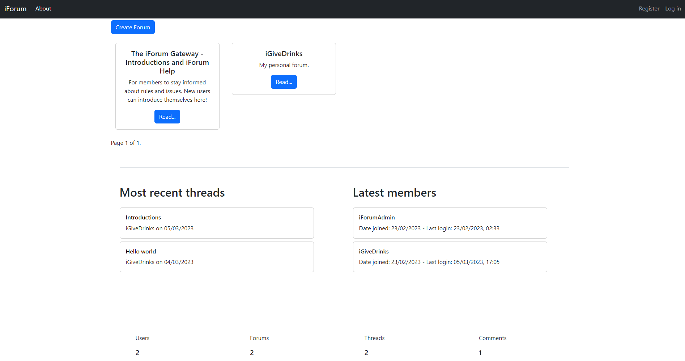

# Django Forum

Forum built upon Django framework. Features custom template tags, pagination, admin functionality, dynamic routes and slugs, read update delete, etc.

## Table of contents

- [Overview](#overview)
  - [Features](#features)
  - [Screenshot](#screenshot)
  - [Links](#links)
- [Development](#development)
  - [Technologies](#technologies)
- [Usage](#usage)
  - [Install dependencies](#install-dependencies)
  - [Run application](#run-application)
- [Continued development](#continued-development)
- [Contact & socials](#contact)
- [Acknowledgements](#acknowledgements)

## Overview

### Features

The application contains the following features:

- Users can perform full crud operations on forums and threads
- User authentication and admin functionality, including admin dashboard
- Front page statistics for total members, most recent threads, etc
- Dynamic routes and slugs for SEO optimization

### Screenshots



### Links

- Django Forum: [Link unavailable]()

## Development

### Technologies

- [Python](https://www.python.org/) - High level object oriented language
- [Django](https://www.djangoproject.com/) - Python based web framework
- [PostgreSQL](https://www.djangoproject.com/) - Open source relational database

## Usage

Navigate to the project directory and run the following commands.

### Install dependencies

```
pip install -r requirements.txt
```

### Run application

```
python manage.py runserver
```

## Continued development

- Profile avatars, thread history, thread bookmarks, image uploading
- Forum management via private dashboards, forum banners & cover images, user roles, and independent forum activity logs

## Contact

- Website - [morganba.net](morganba.net)
- GitHub - [@morganbanet](https://github.com/morganbanet)
- Twitter - [@morganbanet](https://twitter.com/morganbanet)

Contact email can be found via [GitHub](https://gist.github.com/morganbanet) profile.

## Acknowledgements

Books studied for Python & Django:

- [Python Crash Course Second Edition & Third Edition](https://ehmatthes.github.io/pcc_3e/), Eric Matthes.
- [Django 4 by Example](https://djangobyexample.com/), Antonio Melé
