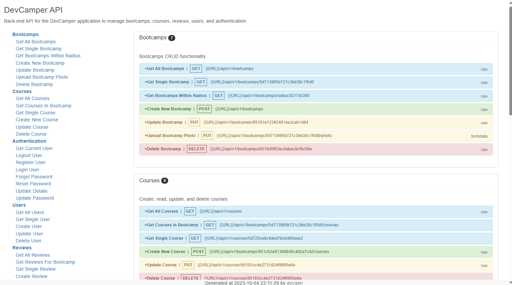

# Devcamper API

Back-end only API for a bootcamp directory website. Provides CRUD functionality for bootcamps, courses, reviews, and users. Uses JSON Web Tokens for authenticaton.

## Table of contents

- [Overview](#overview)
  - [Features](#features)
  - [Screenshot](#screenshot)
  - [Links](#links)
- [Development](#development)
  - [Technologies](#technologies)
- [Usage](#usage)
  - [Making requests](#making-requests)
  - [Build application](#build-application)
  - [Run application](#run-application)
- [Continued development](#continued-development)
- [Contact & socials](#contact)
- [Acknowledgements](#acknowledgements)

## Overview

### Features

This API contains the following features:

- Handles full CRUD operations on bootcamps, courses, reviews, and users
- Provides search results within radius based on postcodes
- Handles the ability to upload, update, and delete images
- Stores JSON Web Token in cookies to authenticate users
- Sends password reset tokens via email using Mailtrap
- Protects, authenticates, and checks ownership of user roles for each route
- Encrypts passwords and reset tokens using encryption packages
- Prevents NoSQL injections, cross site scripting, and HTTP paramter pollution
- Adds additional security headers by default with the helmet package
- Adds rate limiting of 100 requests per 10 minutes
- Uses cors to make the API public

### Screenshots



### Links

- Devcamper documentation: [https://devcamper-td52.onrender.com](https://devcamper-td52.onrender.com)

_Note that free instance types on Render will spin down with inactivity. Please allow a few minutes for the live site to load._

## Development

### Technologies

- [Node.js](https://nodejs.org/en) - JavaScript environment
- [Express](http://expressjs.com/) - Web framework for Node
- [MongoDB Atlas](https://www.mongodb.com/atlas) - NoSQL database in the cloud
- [Mongoose](https://mongoosejs.com/) - Object modelling for MongoDB data
- [Compass](https://www.mongodb.com/products/tools/compass) - GUI for MongoDB querying & analyzing
- [Postman](https://www.postman.com/) - API testing & workspace environment
- [Render](https://render.com/) - Hosting & deployment

## Usage

Rename the "configenv" file in the config folder to "config.env" and update the values/settings appropiately.

### Making requests

Make request to the API using the following URL pattern. Refer to the documentation for more details.

```
https://devcamper-td52.onrender.com/api/v1/<resource>
```

Requests are limited to 100 per 10 minute window. Requests exceeding the limit will respond with a timeout.

### Install dependencies

```
npm install
```

### Run application

```
npm run dev       // Run in development
npm run start    // Run in production
```

## Continued development

- Change email delivery platform from Mailtrap to SendGrid
- Front-end solution built upon the React framework

## Contact

- Website - [morganba.net](morganba.net)
- GitHub - [@morganbanet](https://github.com/morganbanet)
- Twitter - [@morganbanet](https://twitter.com/morganbanet)

Contact email can be found via [GitHub](https://gist.github.com/morganbanet) profile.

## Acknowledgements

Project and design is based on the [Node.js API Masterclass With Express & MongoDB course](https://www.udemy.com/course/nodejs-api-masterclass/) by Brad Traversy on Udemy.
