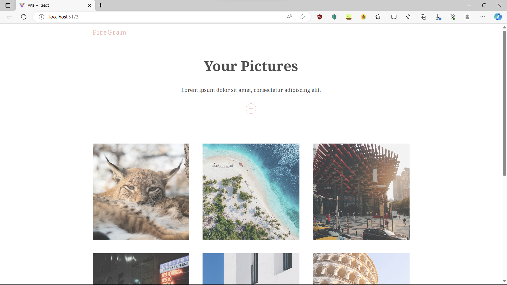

# Firegram

Instagram inspired app built with React and Firebase. Uses framer motion to provide a beautiful interface for uploading and displaying images.

## Table of contents

- [Overview](#overview)
  - [Features](#features)
  - [Screenshot](#screenshot)
  - [Links](#links)
- [Development](#development)
  - [Technologies](#technologies)
- [Usage](#usage)
  - [Install dependencies](#install-dependencies)
  - [Build application](#build-application)
  - [Run application](#run-application)
- [Continued development](#continued-development)
- [Contact & socials](#contact)
- [Acknowledgements](#acknowledgements)

## Overview

### Features

This application contains the following features:

- Add images to the app, hosted on Firebase
- Beautiful design and animations for uploading and viewing images

### Screenshots



### Links

- Firegram: [https://firegram.onrender.com](https://firegram.onrender.com)

_Note that free instance types on Render will spin down with inactivity. Please allow a few minutes for the live site to load._

## Development

### Technologies

- [Vite](https://vitejs.dev/) - Local development server
- [React](https://react.dev/) - Library for building user interfaces
- [Firebase](https://firebase.com/) - Cloud based image & file hosting
- [Render](https://render.com/) - Hosting & deployment

## Usage

### Install dependencies

Run the following command at the root directory to install all required dependencies.

```
npm install
```

### Build application

Run the following command at the root directory to build the dist folder. Also runs `npm install`.

```
npm run build
```

### Run application

Run the following commands from the backend directory.

```
npm run dev       // Run app in development mode
npm run preview   // Run app in preview mode
```

## Continued development

- Authentication and user profiles
- Images associated per user
- Dark mode

## Contact

- Website - [morganba.net](morganba.net)
- GitHub - [@morganbanet](https://github.com/morganbanet)
- Twitter - [@morganbanet](https://twitter.com/morganbanet)

Contact email can be found via [GitHub](https://gist.github.com/morganbanet) profile.

## Acknowledgements

The following tutorials, guides, books, and courses were used to aid in the creation of this project:

- [Build a Photo Gallery With React & Firebase](https://www.youtube.com/watch?v=vUe91uOx7R0&list=WL&index=3), Traversy Media, Net Ninja (YouTube)
