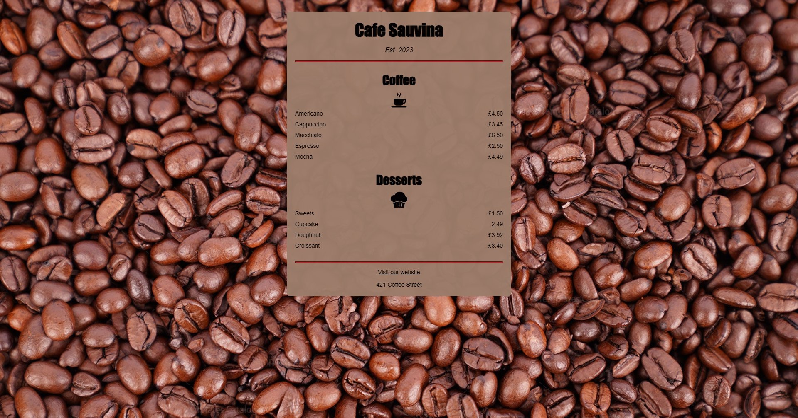

# Cafe Menu

Simple cafe menu built using HTML and CSS. Project and design is based on the [freeCodeCamp Cafe Menu project](https://www.freecodecamp.org/learn/2022/responsive-web-design/learn-basic-css-by-building-a-cafe-menu/step-1).

## Table of contents

- [Overview](#overview)
  - [Features](#features)
  - [Screenshot](#screenshot)
  - [Links](#links)
- [Development](#development)
  - [Technologies](#technologies)
- [Usage](#usage)
  - [Run application](#run-application)
- [Continued development](#continued-development)
- [Contact & socials](#contact)
- [Acknowledgements](#acknowledgements)

## Overview

### Features

The application contains the following features:

- Simple fictional menu design using css to seperate and space text
- Uses icons and fonts for menu design and decoration

### Screenshots

### Links

- Cafe Menu: [https://morganba-cafe-menu.netlify.app](https://morganba-cafe-menu.netlify.app)

## Development

### Technologies

- [HTML](https://developer.mozilla.org/en-US/docs/Web/HTML) - HTML documents for the browser
- [CSS](https://developer.mozilla.org/en-US/docs/Web/CSS) - Stylesheets for HTML documents
- [Netlify](https://www.netlify.com/) - Hosting & deployment

## Usage

### Run application

Install and run via [Live Server](https://marketplace.visualstudio.com/items?itemName=ritwickdey.LiveServer) extension for Visual Studio Code.

## Continued development

- Optimize background images, menu icons, font colours
- Implement responsive design for mobile displays

## Contact

- Website - [morganba.net](morganba.net)
- GitHub - [@morganbanet](https://github.com/morganbanet)
- Twitter - [@morganbanet](https://twitter.com/morganbanet)

Contact email can be found via [GitHub](https://gist.github.com/morganbanet) profile.

## Acknowledgements

Study project from the [freeCodeCamp Responsive Web Design curriculum](https://www.freecodecamp.org/learn/2022/responsive-web-design/).
