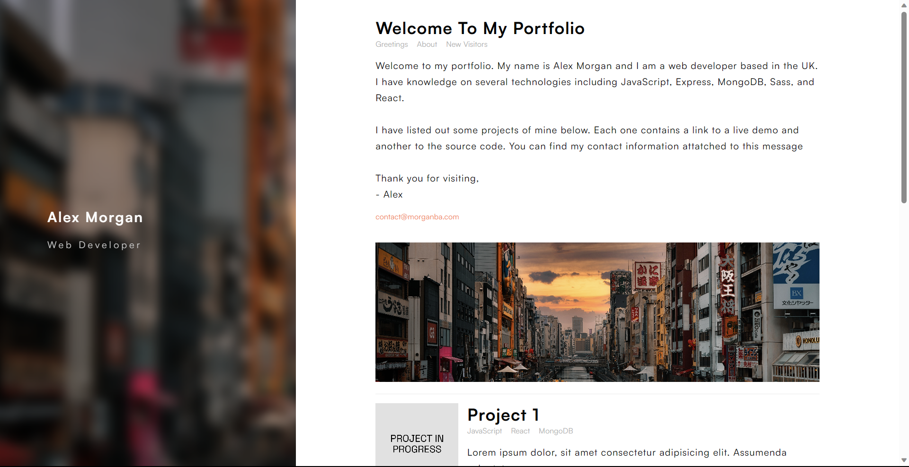

# Glass Portfolio

Beautiful and elegant portfolio/blog website layout built with HTML and SASS. The design is a clone from [Louis Barranqueiro's Tranquilpeak Theme](https://github.com/LouisBarranqueiro/hexo-theme-tranquilpeak).

## Table of contents

- [Overview](#overview)
  - [Features](#features)
  - [Screenshot](#screenshot)
  - [Links](#links)
- [Development](#development)
  - [Technologies](#technologies)
- [Usage](#usage)
  - [Run application](#run-application)
- [Continued development](#continued-development)
- [Contact & socials](#contact)
- [Acknowledgements](#acknowledgements)

## Overview

### Features

The application contains the following features:

- Beautiful and elegant porfolio or blog design layout
- Mobile responsive design layout

### Screenshots

### Links

- Glass Portfolio: [Link unavailable]()

## Development

### Technologies

- [HTML](https://developer.mozilla.org/en-US/docs/Web/HTML) - HTML documents for the browser
- [SASS](https://developer.mozilla.org/en-US/docs/Web/CSS) - CSS library for stylesheets

## Usage

### Run application

Install and run via [Live Server](https://marketplace.visualstudio.com/items?itemName=ritwickdey.LiveServer) extension for Visual Studio Code.

## Continued development

- WebGL2 rain effects on navigation pane dependent on the users geolocation combined with the Weather API
- Toggleable clock and weather widgets for navigation pane

## Contact

- Website - [morganba.net](morganba.net)
- GitHub - [@morganbanet](https://github.com/morganbanet)
- Twitter - [@morganbanet](https://twitter.com/morganbanet)

Contact email can be found via [GitHub](https://gist.github.com/morganbanet) profile.

## Acknowledgements

The design is a clone from [Louis Barranqueiro's Tranquilpeak Theme](https://github.com/LouisBarranqueiro/hexo-theme-tranquilpeak).
