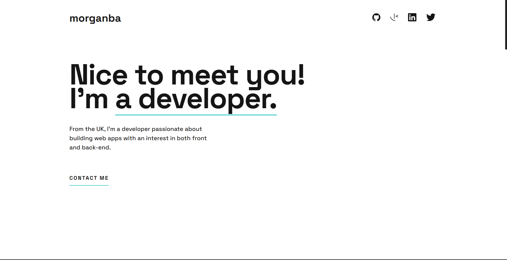

# Modern Portfolio

Modern and clean portfolio site using HTML, CSS, and JavaScript for animations. Project and design is based on the [Frontend Mentor Single Page Developer Portfolio Challenge](https://www.frontendmentor.io/challenges/singlepage-developer-portfolio-bBVj2ZPi-x).

## Table of contents

- [Overview](#overview)
  - [Features](#features)
  - [Screenshot](#screenshot)
  - [Links](#links)
- [Development](#development)
  - [Technologies](#technologies)
- [Usage](#usage)
  - [Run application](#run-application)
- [Continued development](#continued-development)
- [Contact & socials](#contact)
- [Acknowledgements](#acknowledgements)

## Overview

### Features

The application contains the following features:

- Hover and fade in animations
- Type writer effect on landing page
- Functioning contact form
- Modern and clean portfolio design
- Mobile first responsive design

### Screenshots

### Links

- Modern Portfolio: [https://morganba-portfolio.netlify.app](https://morganba-portfolio.netlify.app)

## Development

### Technologies

- [HTML](https://developer.mozilla.org/en-US/docs/Web/HTML) - HTML documents for the browser
- [CSS](https://developer.mozilla.org/en-US/docs/Web/CSS) - Stylesheets for HTML documents
- [Netlify](https://www.netlify.com/) - Hosting & deployment

## Usage

### Run application

Install and run via [Live Server](https://marketplace.visualstudio.com/items?itemName=ritwickdey.LiveServer) extension for Visual Studio Code.

## Continued development

- Refactor and clean up code
- Add particle effects on landing page
- Change from Netlify forms to SendGrid email platforms using Nodemailer

## Contact

- Website - [morganba.net](morganba.net)
- GitHub - [@morganbanet](https://github.com/morganbanet)
- Twitter - [@morganbanet](https://twitter.com/morganbanet)

Contact email can be found via [GitHub](https://gist.github.com/morganbanet) profile.

## Acknowledgements

Project and design is based on the [Frontend Mentor Single Page Developer Portfolio Challenge](https://www.frontendmentor.io/challenges/singlepage-developer-portfolio-bBVj2ZPi-x).
