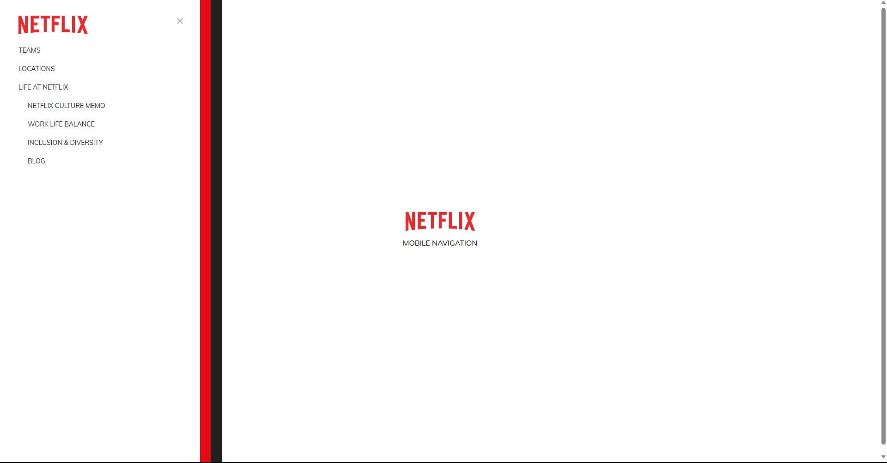

# Netflix Nav

Netflix themed animated navigation pane. Uses HTML and CSS transitions Project and design is based on the [50 Project In 50 Days course](https://www.udemy.com/course/50-projects-50-days/learn/lecture/23599946#overview) by Brad Traversy on Udemy.

## Table of contents

- [Overview](#overview)
  - [Features](#features)
  - [Screenshot](#screenshot)
  - [Links](#links)
- [Development](#development)
  - [Technologies](#technologies)
- [Usage](#usage)
  - [Run application](#run-application)
- [Continued development](#continued-development)
- [Contact & socials](#contact)
- [Acknowledgements](#acknowledgements)

## Overview

### Features

The application contains the following features:

- Clean and minimalist design
- Animated navigation pane using CSS transitions

### Screenshots

### Links

- Netflix Nav: [Link unavailable]()

## Development

### Technologies

- [HTML](https://developer.mozilla.org/en-US/docs/Web/HTML) - HTML documents for the browser
- [CSS](https://developer.mozilla.org/en-US/docs/Web/CSS) - Stylesheets for HTML documents

## Usage

### Run application

Install and run via [Live Server](https://marketplace.visualstudio.com/items?itemName=ritwickdey.LiveServer) extension for Visual Studio Code.

## Continued development

- Mobile responsive design

## Contact

- Website - [morganba.net](morganba.net)
- GitHub - [@morganbanet](https://github.com/morganbanet)
- Twitter - [@morganbanet](https://twitter.com/morganbanet)

Contact email can be found via [GitHub](https://gist.github.com/morganbanet) profile.

## Acknowledgements

Project and design is based on the [50 Project In 50 Days course](https://www.udemy.com/course/50-projects-50-days/learn/lecture/23599946#overview) by Brad Traversy on Udemy.
