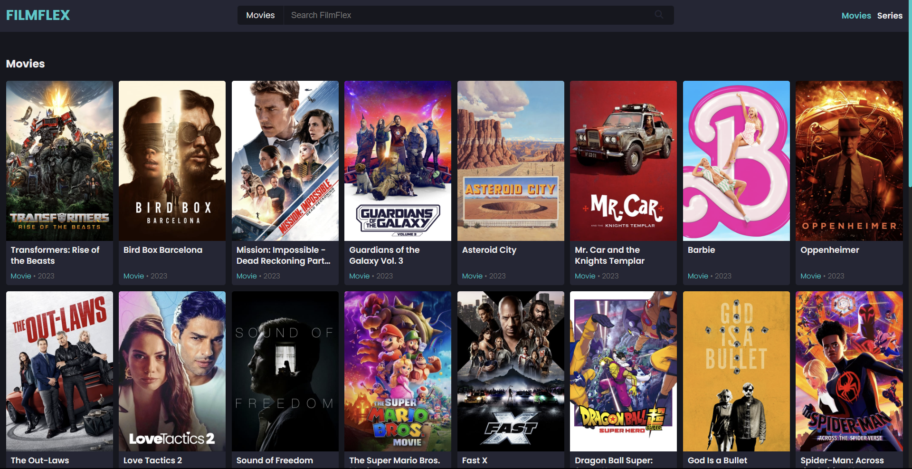
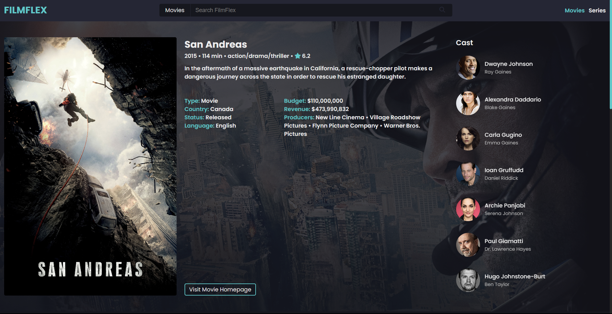

# FilmFlex

Movie guide application built using JavaScript, [The Movie Database API](https://developer.themoviedb.org/docs), and [Swiper](https://swiperjs.com/). Displays information about movies and series, complete with search features, pagination, reviews, ratings, cast, runtimes, budgets, release dates, etc.

## Table of contents

- [Overview](#overview)
  - [Features](#features)
  - [Screenshot](#screenshot)
  - [Links](#links)
- [Development](#development)
  - [Technologies](#technologies)
- [Usage](#usage)
  - [Run application](#run-application)
- [Continued development](#continued-development)
- [Contact & socials](#contact)
- [Acknowledgements](#acknowledgements)

## Overview

### Features

The application contains the following features:

- Displays information on series, episodes, movies, actors, revenues, budgets, countries, languages, runtime, reviews, etc.
- Search movies and TV shows and see suggestions when viewing the details of a movie or TV series.
- Uses the Swiper library for stand-out carousels and mobile friendly navigation optimizations.
- Original and mobile responsive design layout

### Screenshots

### Links

- FilmFlex: [https://morganba-filmflex.netlify.app](https://morganba-filmflex.netlify.app)

## Development

### Technologies

- [HTML](https://developer.mozilla.org/en-US/docs/Web/HTML) - HTML documents for the browser
- [CSS](https://developer.mozilla.org/en-US/docs/Web/CSS) - Stylesheets for HTML documents
- [JavaScript](https://developer.mozilla.org/en-US/docs/Web/javascript) - Scripting functionality
- [Netlify](https://www.netlify.com/) - Hosting & deployment

## Usage

### Run application

Install and run via [Live Server](https://marketplace.visualstudio.com/items?itemName=ritwickdey.LiveServer) extension for Visual Studio Code.

## Continued development

- Fix differences in some card sizes
- Search feature broke weeks after deployment, needs to be patched

## Contact

- Website - [morganba.net](morganba.net)
- GitHub - [@morganbanet](https://github.com/morganbanet)
- Twitter - [@morganbanet](https://twitter.com/morganbanet)

Contact email can be found via [GitHub](https://gist.github.com/morganbanet) profile.

## Acknowledgements

The project uses the [The Movie Database API](https://developer.themoviedb.org/docs) for its content.
