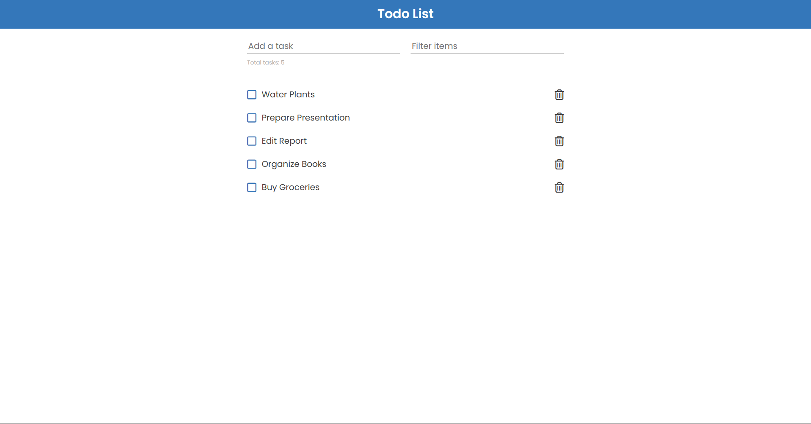

# Todo List

Classic todo list built using object oriented programming and Webpack. Tasks can be added, filtered, marked completed, deleted, and are saved to local storage.

## Table of contents

- [Overview](#overview)
  - [Features](#features)
  - [Screenshot](#screenshot)
  - [Links](#links)
- [Development](#development)
  - [Technologies](#technologies)
- [Usage](#usage)
  - [Install dependencies](#install-dependencies)
  - [Build application](#build-application)
  - [Run application](#run-application)
- [Continued development](#continued-development)
- [Contact & socials](#contact)
- [Acknowledgements](#acknowledgements)

## Overview

### Features

The application contains the following features:

- Create and delete items from the list
- Filter and search items in the list
- Ability to mark items as complete
- Items are saved to local storage
- Original mobile responsive design layout

### Screenshots



### Links

- Todo List: [https://morganba-todos.netlify.app](https://morganba-todos.netlify.app)

## Development

### Technologies

- [HTML](https://developer.mozilla.org/en-US/docs/Web/HTML) - HTML documents for the browser
- [CSS](https://developer.mozilla.org/en-US/docs/Web/CSS) - Stylesheets for HTML documents
- [JavaScript](https://developer.mozilla.org/en-US/docs/Web/javascript) - Scripting functionality
- [Webpack](https://webpack.js.org/) - Module bundler for JS files
- [Netlify](https://www.netlify.com/) - Hosting & deployment

## Usage

### Install dependencies

```
npm install
```

### Build application

```
npm run build
```

### Run application

```
npm run server
```

## Continued development

- Fix marked items not being saved to local storage
- Improve scrolling implementation of list items
- Create and implement mobile responsive design

## Contact

- Website - [morganba.net](morganba.net)
- GitHub - [@morganbanet](https://github.com/morganbanet)
- Twitter - [@morganbanet](https://twitter.com/morganbanet)

Contact email can be found via [GitHub](https://gist.github.com/morganbanet) profile.

## Acknowledgements

No acknowledgements.
