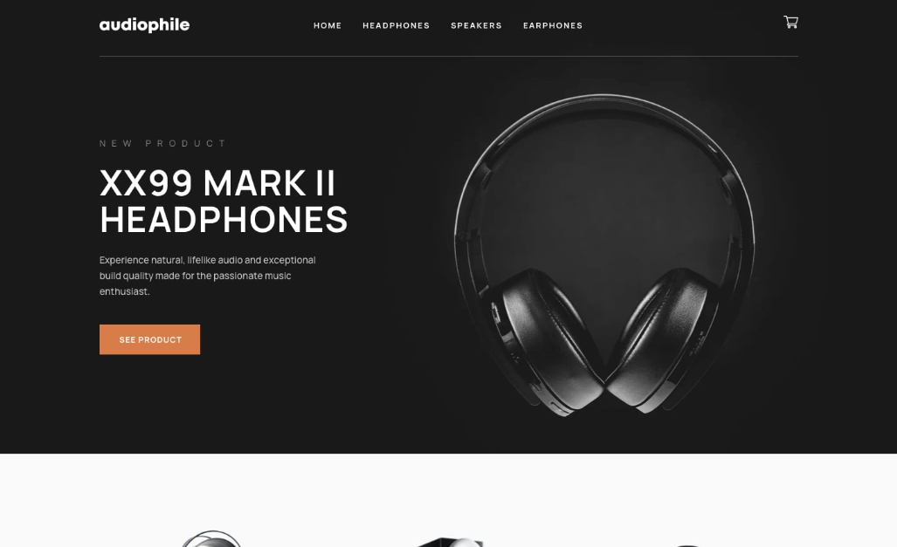

# Audiophile Ecommerce Store

**Work in progress** - Professional and modern ecommerce store built upon the MERN stack. Allows users to browse and add items to cart, pay via PayPal, and recieve order confirmation emails. Project and design is based on the [Frontend Mentor Audiophile e-commerce website Challenge](https://www.frontendmentor.io/challenges/audiophile-ecommerce-website-C8cuSd_wx).

## Table of contents

- [Overview](#overview)
  - [Features](#features)
  - [Screenshot](#screenshot)
  - [Links](#links)
- [Development](#development)
  - [Technologies](#technologies)
- [Usage](#usage)
  - [Install dependencies](#install-dependencies)
  - [Build application](#build-application)
  - [Run application](#run-application)
  - [Seed database](#seed-database)
- [Continued development](#continued-development)
- [Contact & socials](#contact)
- [Acknowledgements](#acknowledgements)

## Overview

### Features

The application contains the following features:

- Allows users to browse and add items to cart
- PayPal testing integration and recieve confirmation orders via email
- Built as a SPA using React alongside a custom API on the backend
- Professional and modern responsive design layout provided by Frontend Mentor

### Screenshots



### Links

- Audiophile: [Link unavailable]()

## Development

### Technologies

- [React](https://react.dev/) - Library for building user interfaces
- [Node.js](https://nodejs.org/en) - JavaScript runtime environment
- [Express](http://expressjs.com/) - Web framework for building APIs
- [MongoDB Atlas](https://www.mongodb.com/atlas) - NoSQL database in the cloud
- [Mongoose](https://mongoosejs.com/) - Object modelling for MongoDB data
- [Compass](https://www.mongodb.com/products/tools/compass) - GUI for MongoDB querying & analyzing
- [Postman](https://www.postman.com/) - API testing & workspace environment

## Usage

Rename the "env.sample" file in the config folder to ".env" and update the values/settings appropiately.

### Install dependencies

```
npm install
```

### Build application

```
npm run build
```

### Run application

```
npm run dev       // Run server & client
npm run server    // Run server only
```

### Seed database

```
npm run data:import       // Import data
npm run data:flush        // Flush database
```

## Continued development

- Work in progress

## Contact

- Website - [morganba.net](morganba.net)
- GitHub - [@morganbanet](https://github.com/morganbanet)
- Twitter - [@morganbanet](https://twitter.com/morganbanet)

Contact email can be found via [GitHub](https://gist.github.com/morganbanet) profile.

## Acknowledgements

Project and design is based on the [Frontend Mentor Audiophile e-commerce website Challenge](https://www.frontendmentor.io/challenges/audiophile-ecommerce-website-C8cuSd_wx).
