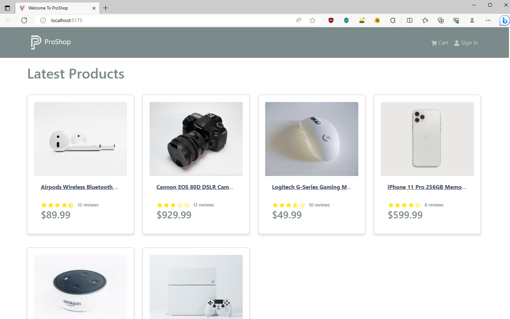

# Proshop E-commerce

**Work in progress** - Modern ecommerce store built upon the MERN stack. Allows users to browse and add items to cart, pay via PayPal, and recieve order confirmation emails.

## Table of contents

- [Overview](#overview)
  - [Features](#features)
  - [Screenshot](#screenshot)
  - [Links](#links)
- [Development](#development)
  - [Technologies](#technologies)
- [Usage](#usage)
  - [Install dependencies](#install-dependencies)
  - [Build application](#build-application)
  - [Run application](#run-application)
  - [Seed database](#seed-database)
- [Continued development](#continued-development)
- [Contact & socials](#contact)
- [Acknowledgements](#acknowledgements)

## Overview

### Features

This application contains the following features:

- Browse products with pagination, add items to cart, save cart in local storage
- Private admin dashboard for creating, updating, deleting products, and uploading images via Multer
- Stores JSON Web Token in cookies to authenticate users
- Sends password reset tokens via email using Mailtrap
- Protects, authenticates, and checks ownership of user roles for each route
- Encrypts passwords and reset tokens using encryption packages
- PayPal integration and recieve confirmation orders via email

### Screenshots



### Links

- Proshop e-commerce: [Link unavailable]()

_Note that free instance types on Render will spin down with inactivity. Please allow a few minutes for the live site to load._

## Development

### Technologies

- [Vite](https://vitejs.dev/) - Local development server
- [React](https://react.dev/) - Library for building user interfaces
- [React Bootstrap](https://react-bootstrap.github.io/) - Front-end components for React
- [Redux Toolkit](https://redux.js.org/) - React state management
- [Node.js](https://nodejs.org/en) - JavaScript environment
- [Express](http://expressjs.com/) - Web framework for building APIs with Node
- [MongoDB Atlas](https://www.mongodb.com/atlas) - NoSQL database in the cloud
- [Mongoose](https://mongoosejs.com/) - Object modelling for MongoDB data
- [Compass](https://www.mongodb.com/products/tools/compass) - GUI for MongoDB querying & analyzing
- [Postman](https://www.postman.com/) - API testing & workspace environment
- [Render](https://render.com/) - Hosting & deployment

## Usage

Rename the "env.sample" file in the config folder to ".env" and update the values/settings appropiately.

### Install dependencies

```
npm install
```

### Build application

```
npm run build
```

### Run application

```
npm run dev       // Run server & client
npm run server    // Run server only
```

### Seed database

```
npm run data:import       // Import data
npm run data:flush        // Flush database
```

## Continued development

- Work in progress

## Contact

- Website - [morganba.net](morganba.net)
- GitHub - [@morganbanet](https://github.com/morganbanet)
- Twitter - [@morganbanet](https://twitter.com/morganbanet)

Contact email can be found via [GitHub](https://gist.github.com/morganbanet) profile.

## Acknowledgements

Project and design is based on the [MERN from Scratch 2023 | eCommerce Platform course](https://www.udemy.com/course/mern-ecommerce/) by Brad Traversy on Udemy.
