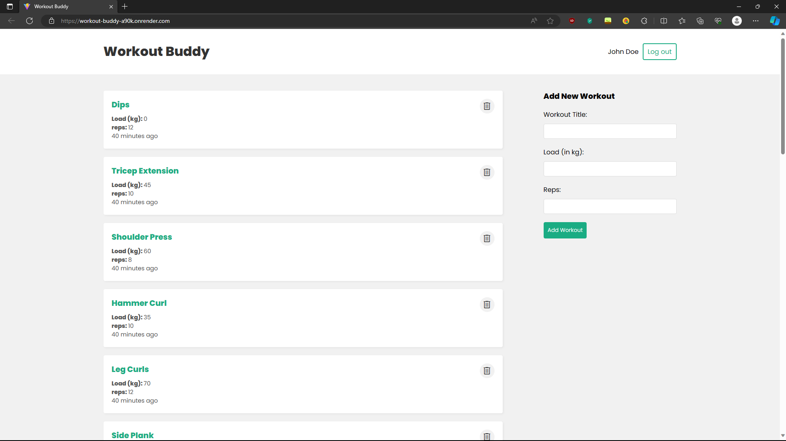

# Workout Buddy

Workout tracking app build upon the MERN stack. Allows users to login or register, and manage a history of workouts on their dashboard.

## Table of contents

- [Overview](#overview)
  - [Features](#features)
  - [Screenshot](#screenshot)
  - [Links](#links)
- [Development](#development)
  - [Technologies](#technologies)
- [Usage](#usage)
  - [Install dependencies](#install-dependencies)
  - [Build application](#build-application)
  - [Run application](#run-application)
  - [Seed database](#seed-database)
- [Continued development](#continued-development)
- [Contact & socials](#contact)
- [Acknowledgements](#acknowledgements)

## Overview

### Features

This application contains the following features:

- Add and delete workout items on the dashboard
- Register, login, and logout of the website securely
- Stores JSON Web Tokens in a HTTP-Only cookie to authenticate users
- Protects routes from unauthorized users requiring signing in
- Checks ownership of resources when users make requests
- Hashes passwords and reset tokens using encryption packages

### Screenshots



### Links

- Workout Buddy: [https://workout-buddy-a90k.onrender.com](https://workout-buddy-a90k.onrender.com)

_Note that free instance types on Render will spin down with inactivity. Please allow a few minutes for the live site to load._

## Development

### Technologies

- [Vite](https://vitejs.dev/) - Local development server
- [React](https://react.dev/) - Library for building user interfaces
- [Node.js](https://nodejs.org/en) - JavaScript environment
- [Express](http://expressjs.com/) - Web framework for building APIs with Node
- [MongoDB Atlas](https://www.mongodb.com/atlas) - NoSQL database in the cloud
- [Mongoose](https://mongoosejs.com/) - Object modelling for MongoDB data
- [Compass](https://www.mongodb.com/products/tools/compass) - GUI for MongoDB querying & analyzing
- [Postman](https://www.postman.com/) - API testing & workspace environment
- [Render](https://render.com/) - Hosting & deployment

## Usage

Rename the "configenv.txt" file in the backend/config directory to ".env" and update the variables appropiately.

### Install dependencies

Run the following command in both the frontend and backend directories.

```
npm install
```

### Build application

Run the following command from the backend directory. This will also install dependencies in both the frontend and backend.

```
npm run build
```

### Run application

Run the following commands from the backend directory.

```
npm run dev       // Run server & client
npm run server    // Run server only
```

### Seed database

Run the following commands from the backend directory.

```
npm run data:import       // Import sample data
npm run data:flush        // Flush database
```

## Continued development

Ideas for future development...

- Password reset & verification emails
- Edit & update workouts
- Dark mode

## Contact

- Website - [morganba.net](morganba.net)
- GitHub - [@morganbanet](https://github.com/morganbanet)
- Twitter - [@morganbanet](https://twitter.com/morganbanet)

Contact email can be found via [GitHub](https://gist.github.com/morganbanet) profile.

## Acknowledgements

The following tutorials, guides, books, and courses were used to aid in the creation of this project:

- [MERN Stack Crash Course Tutorial](https://www.youtube.com/playlist?list=PL4cUxeGkcC9iJ_KkrkBZWZRHVwnzLIoUE), youtube/@NetNinja

- [MERN Stack Auth Tutorial](https://www.youtube.com/playlist?list=PL4cUxeGkcC9g8OhpOZxNdhXggFz2lOuCT), youtube/@NetNinja
