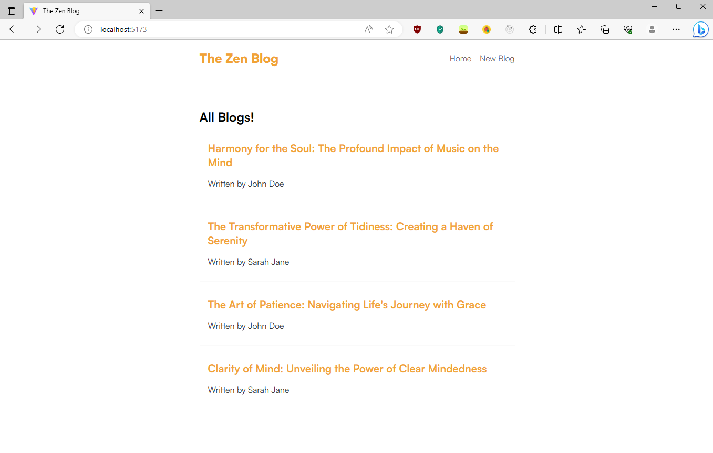

# Zen Blog

Minimalist blogging application built with React, Express, Node, and MongoDB. Allows users to create, read, and delete posts.

## Table of contents

- [Overview](#overview)
  - [Features](#features)
  - [Screenshot](#screenshot)
  - [Links](#links)
- [Development](#development)
  - [Technologies](#technologies)
- [Usage](#usage)
  - [Install dependencies](#install-dependencies)
  - [Build application](#build-application)
  - [Run application](#run-application)
  - [Seed database](#seed-database)
- [Continued development](#continued-development)
- [Contact & socials](#contact)
- [Acknowledgements](#acknowledgements)

## Overview

### Features

The application contains the following features:

- Handles create, read, and delete operations on blogs
- Sorts blogs in descending order, from newest to oldest
- Adds additional security headers by default with the helmet package
- Adds rate limiting of 100 requests per 10 minute window
- Simple and minimalist design

### Screenshots



### Links

- Zen Blog: [https://zen-blog.onrender.com](https://zen-blog.onrender.com)

## Development

### Technologies

- [React](https://react.dev/) - Library for building user interfaces
- [Node.js](https://nodejs.org/en) - JavaScript runtime environment
- [Express](http://expressjs.com/) - Web framework for building APIs
- [MongoDB Atlas](https://www.mongodb.com/atlas) - NoSQL database in the cloud
- [Mongoose](https://mongoosejs.com/) - Object modelling for MongoDB data
- [Compass](https://www.mongodb.com/products/tools/compass) - GUI for MongoDB querying & analyzing
- [Postman](https://www.postman.com/) - API testing & workspace environment
- [Render](https://render.com/) - Hosting & deployment

## Usage

Rename the "env.sample" file in the config folder to ".env" and update the values/settings appropiately.

### Install dependencies

```
npm install
```

### Build application

```
npm run build
```

### Run application

```
npm run dev       // Run server & client
npm run server    // Run server only
```

### Seed database

```
npm run data:import       // Import data
npm run data:flush        // Flush database
```

## Continued development

- User authentication, profiles, profile avatars, password reset emails, etc
- Trending and newest blog posts, blog statistics, archives screen
- Image and video uploading via Firebase
- Edit and rename posts

## Contact

- Website - [morganba.net](morganba.net)
- GitHub - [@morganbanet](https://github.com/morganbanet)
- Twitter - [@morganbanet](https://twitter.com/morganbanet)

Contact email can be found via [GitHub](https://gist.github.com/morganbanet) profile.

## Acknowledgements

No acknowledgements.
