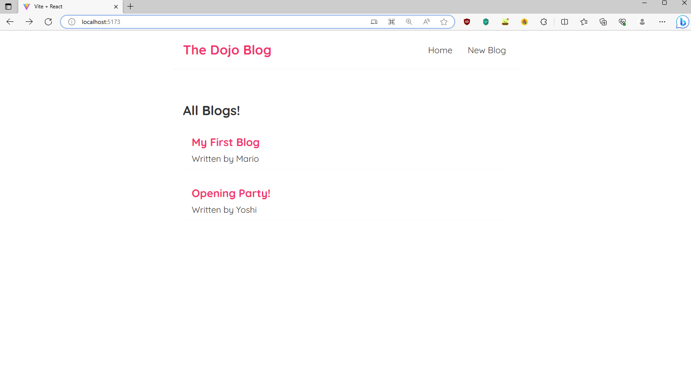

# Dojo Blog

Minimalist blogging application built with React and JSON server. Allows users to read, edit, and delete blog posts. Project and design is based on the [Full Modern React Tutorial](https://www.youtube.com/playlist?list=PL4cUxeGkcC9gZD-Tvwfod2gaISzfRiP9d) by Net Ninja on YouTube.

## Table of contents

- [Overview](#overview)
  - [Features](#features)
  - [Screenshot](#screenshot)
  - [Links](#links)
- [Development](#development)
  - [Technologies](#technologies)
- [Usage](#usage)
  - [Install dependencies](#install-dependencies)
  - [Build application](#build-application)
  - [Run application](#run-application)
- [Continued development](#continued-development)
- [Contact & socials](#contact)
- [Acknowledgements](#acknowledgements)

## Overview

### Features

The application contains the following features:

- Handles create, read, and delete operations on blogs
- Simple and minimalist design

### Screenshots



### Links

- Dojo Blog: [Link unavailable]()

## Development

### Technologies

- [React](https://react.dev/) - Library for building user interfaces

## Usage

### Install dependencies

```
npm install
```

### Build application

```
npm run build
```

### Run application

```
npm run dev       // Run client only
npm run server    // Run server only
```

## Continued development

- Implement custom API with user authentication
- Responsive design layout

## Contact

- Website - [morganba.net](morganba.net)
- GitHub - [@morganbanet](https://github.com/morganbanet)
- Twitter - [@morganbanet](https://twitter.com/morganbanet)

Contact email can be found via [GitHub](https://gist.github.com/morganbanet) profile.

## Acknowledgements

Project and design is based on the [Full Modern React Tutorial](https://www.youtube.com/playlist?list=PL4cUxeGkcC9gZD-Tvwfod2gaISzfRiP9d) by Net Ninja on YouTube.
