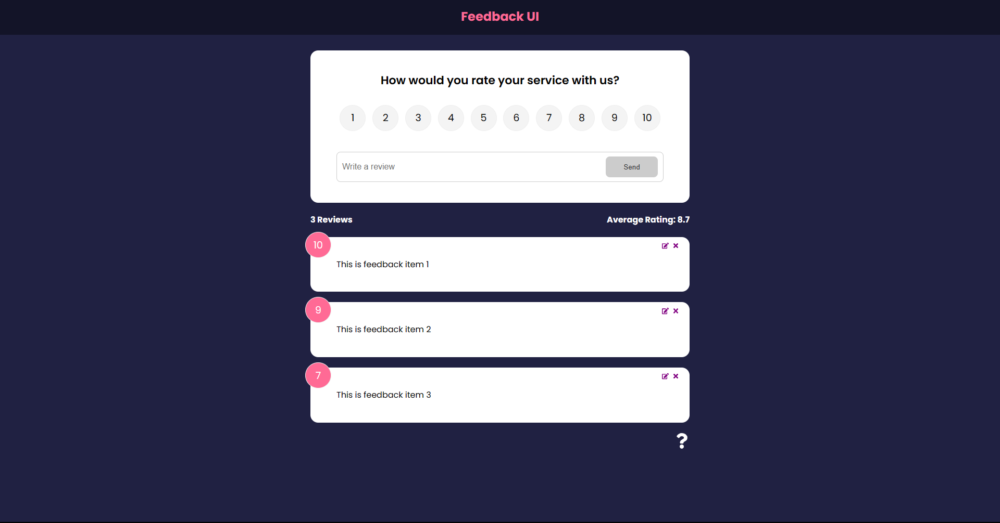

# Feedback UI

Feedback form built with React allowing users to create, edit, and delete reviews. Project and design is based on the [React Front to Back Feedback UI project](https://www.udemy.com/course/react-front-to-back-2022/) by Brad Traversy on Udemy.

## Table of contents

- [Overview](#overview)
  - [Features](#features)
  - [Screenshot](#screenshot)
  - [Links](#links)
- [Development](#development)
  - [Technologies](#technologies)
- [Usage](#usage)
  - [Install dependencies](#install-dependencies)
  - [Build application](#build-application)
  - [Run application](#run-application)
- [Continued development](#continued-development)
- [Contact & socials](#contact)
- [Acknowledgements](#acknowledgements)

## Overview

### Features

The application contains the following features:

- Handles create, read, and delete operations on reviews
- Simple design

### Screenshots



### Links

- Feedback UI: [https://morganba-feedbackui.netlify.app](https://morganba-feedbackui.netlify.app)

## Development

### Technologies

- [React](https://react.dev/) - Library for building user interfaces

## Usage

### Install dependencies

```
npm install
```

### Build application

```
npm run build
```

### Run application

```
npm run dev       // Development server
npm run preview   // Preview server
```

## Continued development

- Connect to database

## Contact

- Website - [morganba.net](morganba.net)
- GitHub - [@morganbanet](https://github.com/morganbanet)
- Twitter - [@morganbanet](https://twitter.com/morganbanet)

Contact email can be found via [GitHub](https://gist.github.com/morganbanet) profile.

## Acknowledgements

Project and design is based on the [React Front to Back Feedback UI project](https://www.udemy.com/course/react-front-to-back-2022/) by Brad Traversy on Udemy.
