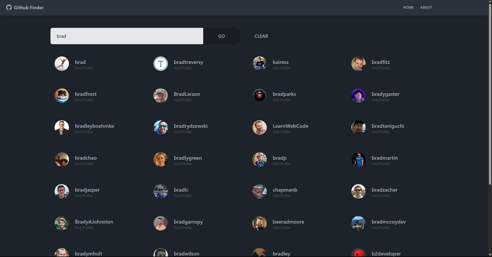
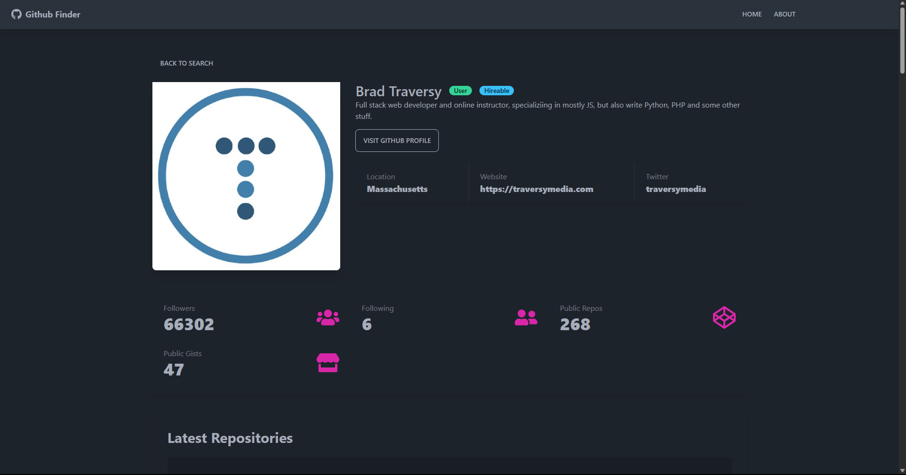

# GitHub Finder

GitHub profile finder built using React, Tailwind CSS, and Daisy UI. Project and design is based on the [React Front to Back Feedback GitHub Finder project](https://www.udemy.com/course/react-front-to-back-2022/) by Brad Traversy on Udemy.

## Table of contents

- [Overview](#overview)
  - [Features](#features)
  - [Screenshot](#screenshot)
  - [Links](#links)
- [Development](#development)
  - [Technologies](#technologies)
- [Usage](#usage)
  - [Generate API key](#generate-api-key)
  - [Install dependencies](#install-dependencies)
  - [Build application](#build-application)
  - [Run application](#run-application)
- [Continued development](#continued-development)
- [Contact & socials](#contact)
- [Acknowledgements](#acknowledgements)

## Overview

### Features

The application contains the following features:

- Search GitHub users and view profile details
- See users follower count, latest repos, following, etc

### Screenshots




### Links

- GitHub Finder: [https://github-finder-bkhhcpru9-morganbanet.vercel.app](https://github-finder-bkhhcpru9-morganbanet.vercel.app)

## Development

### Technologies

- [React](https://react.dev/) - Library for building user interfaces
- [Tailwind CSS](https://tailwindcss.com/) - CSS framework
- [Dasiy UI](https://daisyui.com/) - Class names for Tailwind CSS

## Usage

### Generate API Key

Create an `.env` file at the root directory and place GitHub API key

```
REACT_APP_GITHUB_URL="https://api.github.com"
REACT_APP_GITHUB_TOKEN="xxxxx xxxxxx xxxxxxx" // API key
```

### Install dependencies

```
npm install
```

### Build application

```
npm run build
```

### Run application

```
npm run start
```

## Continued development

- No futher development planned

## Contact

- Website - [morganba.net](morganba.net)
- GitHub - [@morganbanet](https://github.com/morganbanet)
- Twitter - [@morganbanet](https://twitter.com/morganbanet)

Contact email can be found via [GitHub](https://gist.github.com/morganbanet) profile.

## Acknowledgements

Project and design is based on the [React Front to Back Feedback GitHub Finder project](https://www.udemy.com/course/react-front-to-back-2022/) by Brad Traversy on Udemy.
